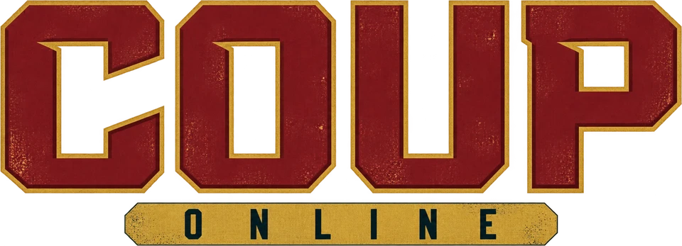
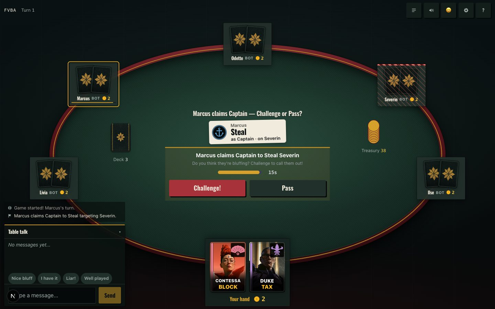
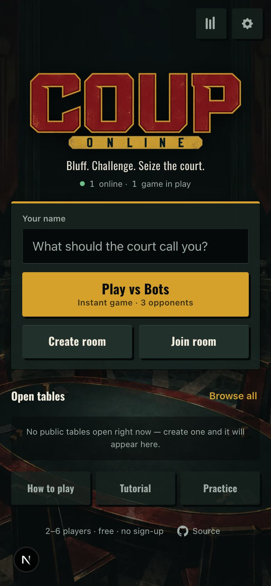
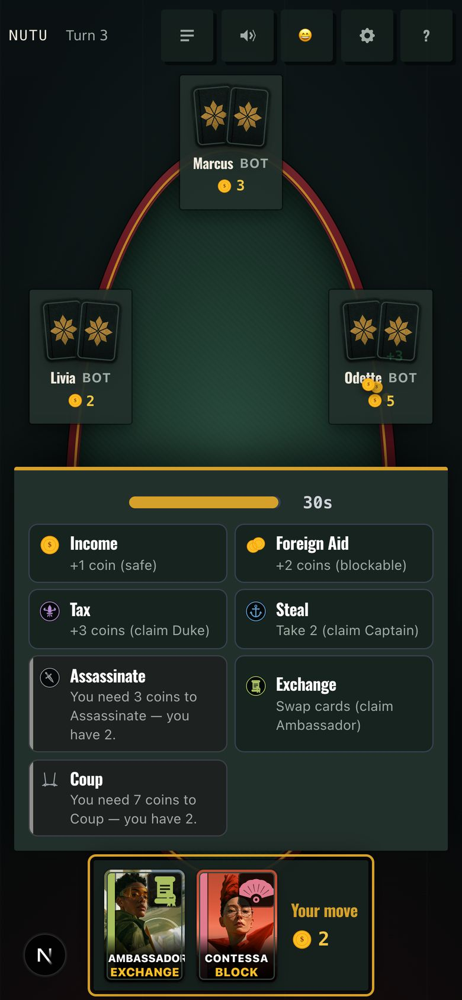

<p align="center">
  
</p>

<p align="center">
  
  
  
  
  
  
</p>

<p align="center">
  A real-time multiplayer web adaptation of the classic bluffing card game.<br>
  <a href="https://coup.8tp.dev"><b>Play at coup.8tp.dev</b></a>
</p>

<p align="center">
  
  
  
  
  
</p>

<p align="center">
  
</p>
<p align="center">
  
  &nbsp;
  
</p>

---

Play Coup with 2–6 players from any device, with no app install and no accounts. Create a room, share the code or QR link, add bots if you want, and start. The server enforces every rule, so nobody can cheat. Challenge, block and turn windows are timed, and the layout is built for phones first.

## Features

### Multiplayer
- **Real-time WebSocket gameplay**: instant action broadcasts via Socket.io
- **Server-authoritative**: all game logic runs server-side; clients never see hidden cards
- **Play vs Bots**: one tap from the home screen into a game against three bots
- **Room codes**: 4-letter codes for easy sharing, no accounts required; your name is remembered
- **Public/private rooms**: browse public lobbies, join open games, or watch live games as a spectator
- **QR sharing**: lobby share button opens a scannable room link
- **Practice vs Bots**: pick 1–3 opponents, a bot style (Gentle, Sharp, Ruthless) and Classic or Reformation; an optional coach points at the part of the table each tip is about
- **Computer players**: add 1–5 AI opponents with 7 personality types (Aggressive, Conservative, Vengeful, Deceptive, Analytical, Optimal, Random)
- **Reconnection**: signed session tokens let players rejoin mid-game without losing their seat; a refresh in the lobby holds your seat for 45 seconds
- **Host moderation**: hosts can remove lobby players or spectators before the game starts
- **Disconnect recovery**: disconnected in-game players are replaced by an optimal bot after 60 seconds; a player who leaves is replaced at once, and an idle player after two timed-out turns
- **Auto-cleanup**: rooms expire after 24 hours; abandoned in-progress games with no connected humans are removed after 120 seconds

### Game Rules
- **Complete 2012 base game**: Income, Foreign Aid, Tax, Steal, Assassinate, Exchange, Coup
- **Reformation expansion**: Factions (Loyalist/Reformist), Convert, Embezzle, Treasury Reserve, Inquisitor character with Examine action
- **Full challenge system**: any player can call a bluff; failed challenges cost an influence
- **Block and counter-block**: Duke blocks Foreign Aid, Contessa blocks Assassination, Captain/Ambassador/Inquisitor block Steal
- **Forced Coup**: 10+ coins means you must Coup
- **Timed responses**: the host sets action windows of 10–60 seconds and turn windows of 15–90 seconds

### Interface
- **The court table**: opponents sit around an oval table in turn order; the action being claimed lands in the middle as a printed plaque, blocks stamp across it, and coins fly between the treasury and the seats
- **Heraldic character emblems**: fleur-de-lis (Duke), stiletto (Assassin), anchor (Captain), sealed scroll (Ambassador), fan (Contessa) and radiant eye (Inquisitor), on every card and prompt
- **Mobile-first**: every tap target is at least 44px (audited at 360×640, 390×844 and desktop); on phones every decision lives in a bottom sheet in the thumb zone
- **Table talk**: chat stays on screen beside your hand on desktop, with one-tap quick lines; on phones it lives in the log drawer, and chat lines appear at the speaker's seat
- **Sound and music**: recorded sound effects for every game event, mixed in loudness tiers so a lost influence always outranks routine sounds, and an adaptive score of 15 pieces that shifts with the game (court, tension, the 1v1 duel, sudden death, and a quieter bed once you are out); sound, music and music-volume controls
- **Motion and impact**: one animation clock, card flights, hitstop, screen shake on the felt only, and a reduced-animation setting that collapses motion to fades without losing information
- **Haptic feedback**: vibration on taps and incoming events for mobile devices (with iOS Safari fallback), togglable in settings
- **Settings**: sound, music, haptics (touch devices), reduced animation and text size (Normal / Large / Extra large), from home, lobby and in-game
- **Player stats**: local lifetime stats, awards, and match history are available from the home screen
- **Emoji reactions**: 12 reactions visible to all players. Bots fire context-aware reactions driven by per-bot personality traits (emotiveness and meanness)
- **Rules and guides**: a six-chapter interactive tutorial played out on a miniature court table (the goal, your turn, claims, challenges, blocks, coins), built-in rules, coached practice games, and an interactive Reformation walkthrough
- **Action log**: the latest events beside your hand, the full history in the log drawer
- **Game over screen**: personalized flavor text, staged winning-hand/table-truth reveal, recap cards, up to 4 awards, and copy/download recap export
- **Player mute controls**: locally hide a player's chat messages and reaction bubbles without changing the table for everyone else
- **Installable app**: install prompt, app icons, standalone display metadata, and production asset caching for weak Wi-Fi

## Requirements

- Node.js 20.19+ (or 22.12+) to satisfy the current Vite/Vitest toolchain

## Getting Started

```sh
git clone https://github.com/8tp/Coup.git
cd Coup
npm install
npm run dev
```

The server starts at [http://localhost:3000](http://localhost:3000). Open it in multiple browser tabs to test multiplayer.

### How to Play

1. Enter your name, or tap **Play vs Bots** to start a game against three bots right away
2. Tap **Create room** (choose public or private) and share the 4-letter code, invite link or QR code
3. Friends tap **Join room** and enter the code, follow the link, or pick your table from **Open tables**
4. The host can tap **+ Add bot** or **Fill seats** to add AI opponents
5. The host taps **Start game** once 2–6 players have joined
6. Bluff, challenge and block. The last player with a card wins

### Computer Players

The host can add AI opponents from the lobby. Each bot has a personality type:

| Personality | Play Style | Bluffing | Challenges | Targeting |
|-------------|-----------|----------|------------|-----------|
| **Random** | Hidden random personality | Varies | Varies | Varies |
| **Aggressive** | Offensive actions, high risk | High bluff rates | Aggressive | Always targets leader |
| **Conservative** | Safe play, rarely bluffs | Very low | Rarely challenges | Avoids conflict |
| **Vengeful** | Retaliates against attackers | Moderate | Moderate | Targets last attacker |
| **Deceptive** | Constant bluffs, avoids scrutiny | Highest across all types | Avoids challenging | Leader-focused |
| **Analytical** | Evidence-based, calculated | Low-moderate | High with evidence | Strong leader targeting |
| **Optimal** | Strategic card counting | Selective (~12%) | Card counting-based | Highest-coin player |

All bots share the same architecture (card counting, bluff persistence, deck memory, endgame tactics), and personality parameters change how they use it. Strategies were tuned by analyzing **689,000+ real games** from the [treason](https://github.com/octachrome/treason) online Coup server. See [Bot Strategy Deep Dive](docs/BOT-STRATEGY.md) for the full methodology.

**Core bot capabilities (all personalities):**
- **Card counting**: tracks publicly revealed cards to calculate challenge probabilities
- **Bluff persistence**: establishes a "bluff identity" by re-claiming the same character (3.5x weight boost)
- **Dynamic card values**: context-aware rankings for exchange and influence loss decisions
- **Demonstrated character tracking**: remembers opponents' successful blocks and unchallenged claims
- **Endgame tactics**: 1v1 Steal preference, 3P1L anti-tempo strategy, hail-mary challenges at 1 influence

Bots decide after randomized delays (1.5–3.5s for actions, 0.8–2s for reactions) and follow the same rules as human players. They never peek at hidden cards or the deck.

## Game Rules

### Characters (3 copies each)

| Character | Action | Effect | Blocks |
|-----------|--------|--------|--------|
| **Duke** | Tax | +3 coins | Foreign Aid |
| **Assassin** | Assassinate | Pay 3, target loses influence | — |
| **Captain** | Steal | Take 2 coins from target | Steal |
| **Ambassador** | Exchange | Draw 2 from deck, return 2 | Steal |
| **Contessa** | — | — | Assassination |
| **Inquisitor*** | Exchange / Examine | Draw 1, swap or keep / Look at opponent's card | Steal |

*\*Inquisitor replaces Ambassador in Reformation mode (optional)*

### General Actions

| Action | Effect |
|--------|--------|
| **Income** | +1 coin (safe: cannot be challenged or blocked) |
| **Foreign Aid** | +2 coins (blockable by Duke) |
| **Coup** | Pay 7 coins, target loses influence (unblockable, unchallengeable) |

### Reformation Expansion

The host can enable Reformation mode in the lobby settings. This adds factions, new actions, and the Inquisitor character.

**Factions**: players are assigned to Loyalists (blue) or Reformists (red). You cannot target same-faction players with Coup, Assassinate, Steal, or Examine, and Foreign Aid can only be blocked across faction lines. Challenges are unrestricted. When all surviving players share a faction, restrictions lift.

| Action | Cost | Effect |
|--------|------|--------|
| **Convert** | 1 (self) / 2 (other) | Switch a player's faction. Coins go to Treasury Reserve |
| **Embezzle** | 0 | Take all coins from the Treasury Reserve. Inverse challenge: challenger wins if you DO have Duke; a defended hand is shown and replaced |
| **Examine** | 0 | Target chooses a card for the Inquisitor to inspect. Force swap it or return it |

### Core Mechanics

- **Bluffing**: claim any character action whether you hold that card or not
- **Challenging**: call someone's bluff. If they were honest, you lose an influence. If they lied, they lose one and the action is cancelled
- **Blocking**: certain characters counter certain actions. Blocks can themselves be challenged
- **Elimination**: lose both influences and you're out. Last player standing wins

## Architecture

The server is the single source of truth. Clients send intents (e.g. "play Tax") and receive filtered state. They can only see their own hidden cards and public information.

```
Client A                     Server                      Client B
   |                           |                            |
   |-- game:action (Tax) ----->|                            |
   |                           |-- ActionResolver (pure)    |
   |                           |-- Apply side effects       |
   |<-- game:state (filtered)--|-- game:state (filtered) -->|
```

The `ActionResolver` is a pure state machine: `(state, input) → (newPhase, sideEffects[])`. The `GameEngine` applies side effects (mutate coins, reveal cards, set timers) and broadcasts per-player views through `StateSerializer`.

### Turn Phase Flow

```
AwaitingAction
  ├─ Income ───────────────────────────> resolve ──> next turn
  ├─ Coup ─────────────────────────────> AwaitingInfluenceLoss ──> next turn
  ├─ Convert ──────────────────────────> resolve ──> next turn
  ├─ Tax / Steal / Assassinate / Exchange / Examine / Embezzle
  │   └─> AwaitingActionChallenge
  │         ├─ Challenge ──> resolve
  │         └─ All Pass ──> AwaitingBlock (if blockable)
  │                          or AwaitingExamineSelection (Examine target chooses)
  │                               └─> AwaitingExamineDecision
  │                          or resolve
  └─ ForeignAid
      └─> AwaitingBlock
            ├─ Block ──> AwaitingBlockChallenge
            └─ All Pass ──> resolve
```

## Project Structure

```
Coup/
├── server.ts                       # Express + Socket.io + Next.js entry point
├── docs/                           # Project documentation
│   ├── BOT-STRATEGY.md             # AI strategy research and tuning methodology
│   ├── ASSETS.md                   # Visual asset generation notes and prompts
│   ├── asset-briefs/               # Image-generation briefs for the current assets
│   ├── AUDIO.md                    # Sound bank, soundtrack and how they were generated
│   ├── AUDIO-MIX.md                # Measured mix levels and the loudness gate
│   ├── GAME-FEEL-PLAN.md           # Motion, impact and audio plan
│   ├── screenshots/                # README screenshots
│   ├── CONTRIBUTING.md             # Contribution guidelines
│   ├── PRD.md                      # Product requirements document
│   ├── ROADMAP.md                  # Prioritized post-main product polish and follow-ups
│   └── REFORMATION_PLAN.md         # Reformation expansion implementation plan
├── ART-DIRECTION.md                # Binding visual design rules ("The Ministry")
├── public/                         # PWA icons, social previews, generated art and audio
│   ├── assets/                     # Versioned cards, card back, wordmark, menu backgrounds, app-icon master
│   ├── audio/                      # Recorded sound effects and the soundtrack
│   ├── icons/                      # PWA install icons (v3)
│   ├── favicon-v3.ico              # Browser favicon
│   ├── og-image-v4.jpg             # Open Graph social preview
│   ├── embed-image-v4.jpg          # Twitter/large-card social preview
│   └── sw.js                       # Production service worker for static game assets
├── tests/                          # Test suite
│   ├── engine/                     # Engine unit tests
│   └── server/                     # Server unit tests
├── src/
│   ├── shared/                     # Shared types, constants, protocol
│   │   ├── types.ts                # All TypeScript interfaces and enums
│   │   ├── constants.ts            # Game rules and action definitions
│   │   └── protocol.ts            # Socket.io event contracts
│   │
│   ├── engine/                     # Pure game logic (no I/O)
│   │   ├── GameEngine.ts           # Orchestrator: timers, state, broadcasts
│   │   ├── ActionResolver.ts       # State machine: phase transitions + side effects
│   │   ├── BotBrain.ts             # AI decision logic: personality-parameterized choices
│   │   ├── Game.ts                 # Game state: players, deck, turns, treasury
│   │   ├── Player.ts              # Player model: influences, coins
│   │   └── Deck.ts                # Card deck: shuffle, draw, return
│   │
│   ├── server/                     # Networking and room management
│   │   ├── RoomManager.ts          # Room CRUD, player tracking, TTL cleanup
│   │   ├── SocketHandler.ts        # Routes socket events to engine
│   │   ├── BotController.ts        # Bot timing/execution: delays + engine calls
│   │   ├── ContentFilter.ts        # Name/chat sanitization and moderation checks
│   │   └── StateSerializer.ts     # Per-player state filtering
│   │
│   └── app/                        # Next.js App Router (client UI)
│       ├── page.tsx                # Home: create/join room
│       ├── lobby/[roomCode]/       # Lobby: player list, start game
│       ├── game/[roomCode]/        # Game view
│       ├── hooks/useSocket.ts      # Socket.io client with auto-reconnect
│       ├── stores/
│       │   ├── gameStore.ts        # Zustand store: connection, room, game state
│       │   ├── statsStore.ts       # Local player stats persisted in localStorage
│       │   └── settingsStore.ts    # Zustand store: text size, haptic, motion prefs
│       ├── utils/haptic.ts         # Haptic feedback (vibration + iOS fallback)
│       ├── utils/statsRecorder.ts  # Local post-game stat recording
│       ├── audio/SoundEngine.ts    # Audio graph, measured mix, recorded cues with synth fallbacks, music
│       ├── anim/ · fx/             # Motion engine (flights, hitstop) and impact layer (particles, shake)
│       └── components/
│           ├── game/GameTable.tsx  # The court table layout
│           ├── game/table/         # Seat arcs, claim plaque, coin flights, table talk, log ticker
│           └── icons/emblems.tsx   # The six character emblems
```

## Development

| Command | Description |
|---------|-------------|
| `npm run dev` | Start dev server (Express + Next.js + Socket.io) |
| `npm run build` | Build for production |
| `npm start` | Run production build |
| `npm run typecheck` | Typecheck the app, custom server, and tests |
| `npm test` | Run the test suite (1,100+ tests) |
| `npm run test:e2e` | Run socket browser-flow E2E tests |
| `npm run test:watch` | Run tests in watch mode |

Tests use `tsconfig.test.json` because Next's app typecheck excludes test files. The
dedicated config keeps test fixtures and assertions under the same strict TypeScript
rules without mixing Vitest types into the production app build.

```sh
# Run all tests
npm test

# Run browser-flow E2E tests
npm run test:e2e

# Watch mode during development
npm run test:watch
```

## Deployment

This project requires persistent WebSocket connections. Vercel will not work. Use a platform that supports long-lived server processes.

### Recommended Platforms

- **[Railway](https://railway.app/)**: Git-based deploys, free tier available
- **[Render](https://render.com/)**: Web Service type with WebSocket support
- **[Fly.io](https://fly.io/)**: container-based, globally distributed

Set the build command to `npm run build` and the start command to `npm start`. The `PORT` environment variable is read automatically.

**Optional:** set `DATABASE_URL` (Postgres) to store every finished game, anonymized, and enable `GET /api/stats` with aggregate counts. Without it the server runs exactly the same and the endpoint returns 404. Usage events are also written to the log as one `[metric] {json}` line each (room created/closed, game started/finished/abandoned, bot replacements), with no names, IPs or room codes.

## Contributing

Contributions are welcome. See [CONTRIBUTING.md](docs/CONTRIBUTING.md) for guidelines.

## License

[MIT](LICENSE). See the LICENSE file for details.

## Acknowledgments

- **Coup** is a card game designed by [Rikki Tahta](https://en.wikipedia.org/wiki/Coup_(card_game)), originally published in 2012 by **La Mame Games** and **[Indie Boards & Cards](https://indieboardsandcards.com/our-games/coup/)**
- This is a fan-made digital adaptation for personal and educational use. It is not affiliated with or endorsed by the original creators
- If you enjoy the game, please support the creators by [purchasing the physical game](https://www.amazon.com/Indie-Boards-and-Cards-COU1IBC/dp/B00GDI4HX4)
